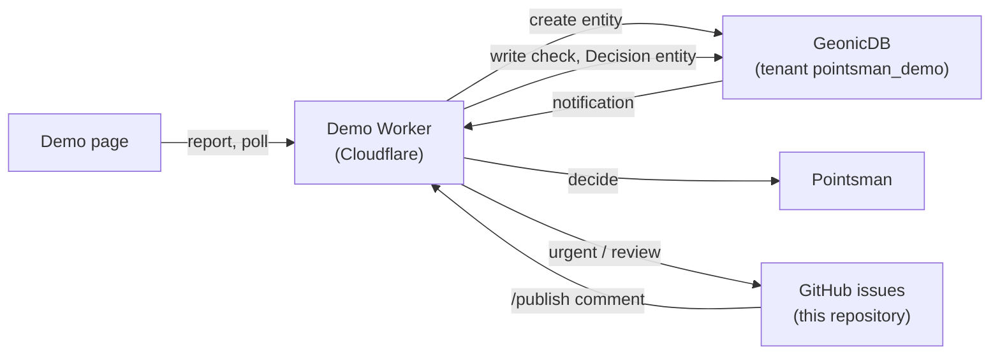

# Pointsman FIWARE demo

A demo of [Pointsman](https://github.com/geolonia/pointsman) with an NGSI-LD
context broker. During heavy rain, reports of closed or restricted roads come
in as `RoadRestriction` entities
([datamodels.jp](https://datamodels.jp/models/transportation/RoadRestriction/)).
Pointsman checks each one within about a second: clear reports go straight to
the residents' map, the others to a person, urgent ones first.

The storyboard and the reasons are in Pointsman's
[docs/fiware-demo.md](https://github.com/geolonia/pointsman/blob/main/docs/fiware-demo.md).

## How it works



1. The page sends a report. The Worker creates a `RoadRestriction` in the
   broker.
2. The broker notifies the Worker (`/notify`, a subscription on the inputs).
   The [bridge](https://github.com/geolonia/pointsman/tree/main/bridge) asks
   Pointsman (profile `road-restriction-check`) and writes the result back to
   the entity as `check`, plus a `Decision` entity.
3. `review` and `urgent` reports become issues here, for prepared reports only
   (free text from visitors never goes to GitHub).
4. A member comments `/publish` or `/reject`, optionally with corrections
   (`/category laneRestriction`, `/danger no`). The Worker resolves the review
   in Pointsman, updates the broker, and closes the issue.
5. Every hour, data older than a day is deleted and its issues are closed.

## API for the page

| Endpoint | |
|---|---|
| `GET /api/config` | Prepared reports, the demo area, whether free text is on, today's usage |
| `GET /api/reports` | The reports with Pointsman's answers and the outcome (`published`) |
| `GET /api/reports/{id}` | One report |
| `POST /api/reports` | `{"prepared": "<id>", "lang": "ja"}`, or free text: `{"roadName", "status", "description", "location", "turnstile"}` |

Only the origins in `ALLOWED_ORIGINS` may call it.

## Limits

- Prepared reports by default; free text only with Cloudflare Turnstile
  (`TURNSTILE_SITE_KEY` and `TURNSTILE_SECRET`), at most 300 characters, inside
  the demo area.
- 10 reports per visitor and minute; `DAILY_LIMIT` reports a day (each is one
  Pointsman call).
- Everything is deleted after a day. Do not write personal data.

## Setup

Settings are in [wrangler.jsonc](wrangler.jsonc). Secrets (`wrangler secret put <NAME>`):

| Secret | Source |
|---|---|
| `POINTSMAN_TOKEN` | A Pointsman token limited to `road-restriction-check` |
| `BROKER_API_KEY` | 1Password `geonic-apps` / `geonicdb-production-geolonia-demo-pointsman_demo-apikey` |
| `NOTIFY_SECRET` | Random; the subscription sends it (`scripts/setup.mjs`) |
| `GITHUB_WEBHOOK_SECRET` | 1Password `geolonia-ops` / "Pointsman demo GitHub App" (password) |
| `GITHUB_APP_PRIVATE_KEY` | Same item, the private key converted to PKCS#8: `openssl pkcs8 -topk8 -nocrypt` |
| `TURNSTILE_SECRET` | Optional |

Then, once: `node scripts/setup.mjs` creates the subscription in the broker and
the issue labels.

## Deployment

Cloudflare Workers Builds watches this repository and deploys `main`; no
credential lives in GitHub, and CI only runs a dry-run deploy. Settings of the
`pointsman-demo` Worker (Settings → Build):

| Setting | Value |
|---|---|
| Git repository | `geolonia/pointsman-demo`, production branch `main` |
| Build command | `node scripts/fetch-engine.mjs && pnpm install --frozen-lockfile` |
| Deploy command | `node scripts/deploy-config.mjs && npx wrangler deploy --config wrangler.deploy.json` |
| Build variables | `DEMO_KV_ID` (the KV namespace id, kept out of this public repository), `NODE_VERSION` `24` |
| Preview builds | Off: previews would run pull request code against the real broker and GitHub |

Secrets are not part of the build; they stay on the Worker (`wrangler secret put`).

## Development

Node.js 24, pnpm 12.

```sh
pnpm install
pnpm engine          # the bridge, from the Pointsman commit in engine.json
pnpm check           # typecheck, tests, dry-run deploy
pnpm dev             # with secrets in .dev.vars
```

For local work on the bridge itself, link a Pointsman checkout instead:
`ln -s ../pointsman engine`.

## License

[MIT](LICENSE). Contributions need a DCO sign-off (`git commit -s`); see
[CONTRIBUTING.md](CONTRIBUTING.md).
