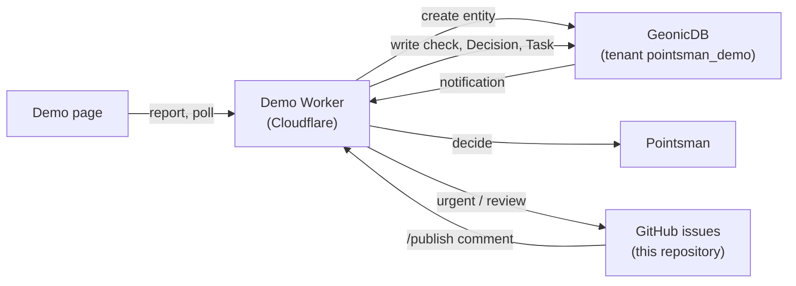

# Pointsman FIWARE demo

A demo of [Pointsman](https://github.com/geolonia/pointsman) on a smart-city
data platform (FIWARE). During heavy rain, residents report closed roads.
Pointsman checks each report within seconds. Clear reports go straight to
the residents' map. Unclear reports go to a person, and urgent reports go to
a person first.

Try it: https://pointsman-demo.geolonia.workers.dev

In FIWARE terms: the reports are `RoadRestriction` entities
([datamodels.jp](https://datamodels.jp/models/transportation/RoadRestriction/))
in GeonicDB, an NGSI-LD context broker. The
[bridge](https://github.com/geolonia/pointsman/tree/main/bridge) connects the
broker to Pointsman. [Why a bridge](https://github.com/geolonia/pointsman/blob/main/bridge/README.md#why-a-bridge)
explains these words.

The storyboard and the reasons are in Pointsman's
[docs/fiware-demo.md](https://github.com/geolonia/pointsman/blob/main/docs/fiware-demo.md).

## How it works


```mermaid
flowchart LR
  Page["Demo page"] -->|report, poll| W["Demo Worker<br/>(Cloudflare)"]
  W -->|create entity| B["GeonicDB<br/>(tenant pointsman_demo)"]
  B -->|notification| W
  W -->|decide| P["Pointsman"]
  W -->|write check, Decision, Task| B
  W -->|urgent / review| G["GitHub issues<br/>(this repository)"]
  G -->|"/publish comment"| W
```

1. The page sends a report. The Worker creates a `RoadRestriction` in the
   broker.
2. The broker notifies the Worker (`/notify`, a subscription on the inputs).
   The [bridge](https://github.com/geolonia/pointsman/tree/main/bridge) asks
   Pointsman (profile `road-restriction-check`) and writes the result back to
   the entity as `check`, plus a `Decision` entity.
3. `review` and `urgent` reports become issues here, for prepared reports only
   (free text from visitors never goes to GitHub). Each one also gets a
   `Task` entity ([datamodels.jp](https://datamodels.jp/models/task/Task/)),
   so any app that lists tasks from the broker shows the work.
4. The chain: a second subscription sends `urgent` and `review` results to
   `/notify?route=evacuation`. The bridge asks Pointsman again (profile
   `evacuation-access-check`: does the closure cut people off from their
   evacuation site?) and writes `evacuation`, plus a `Decision` entity that
   links the first one (`wasInformedBy`). An `alert` creates an `Alert`
   entity (Smart Data Models) for the site's staff.
5. A member comments `/publish` or `/reject`, optionally with corrections
   (`/category laneRestriction`, `/danger no`). The Worker resolves the review
   in Pointsman, writes the result to the `Decision` entity, and closes the
   issue. On the page, the visitor who sent a report can decide it the same
   way (Publish or Reject).
6. A third subscription sends resolved `Decision` entities to `/reviews`. The
   bridge writes the final action to the report (the page shows it as
   published) and completes the Task. This also works without GitHub: any
   app that writes the result to the Decision entity resolves the review
   (pointsman#83), for example `scripts/resolve.mjs`. Apps that keep their
   own work orders, such as Redmine with GTT, resolve it by completing a
   `Task` that refers to the report (pointsman#85): its status name gives
   the final action ([src/work-orders.json](src/work-orders.json):
   `Published` or `公開` → publish, `Rejected` or `却下` → reject).
7. Every hour, data older than a day is deleted (with its Decision, Task and
   Alert entities) and its issues are closed.

No notification gets lost (pointsman#88). The Worker puts each notified
entity on a queue (`pointsman-demo-bridge`) and answers the broker at once.
The Worker's queue handler then runs steps 2 to 4 and 6.

- If Pointsman or the broker fails, the handler tries again after 30
  seconds, then waits twice as long each time, up to an hour: about 14 hours
  in all (20 tries). With a configuration error it waits 5 minutes each time,
  so about 100 minutes.
- After the last try the message goes to the queue
  `pointsman-demo-bridge-dlq`. Nothing reads that queue: check its messages
  in the Cloudflare dashboard (Queues), within its retention time (4 days by
  default), and send the report again if needed.
- The decision is safe, but the issue (step 3) and the Alert (step 4) are
  not tried again: if GitHub or the broker refuses them, the error is logged
  and the message is done. A second try would find the decision already
  written and do nothing.

## The page

https://pointsman-demo.geolonia.workers.dev — `site/`, served by the Worker
(static assets), in English and Japanese, light and dark:

a guided flow in three steps, for visitors who know nothing about FIWARE or AI:

1. **Pick a report.** Four examples, one for each outcome (a clear report, an
   unclear one, someone in danger, near an evacuation site); the others under
   "More examples". Each card says what happened and where, by a landmark
   (a station, park or river), since most streets in Japan have no name; it
   also lists the map checks Pointsman will run.
2. **Pointsman decides.** Each step with its time, the AI's answers as plain
   questions with a confidence word, the map checks (question, answer and
   data source, apart from the AI's answers), and the city's rule in one
   sentence. On the headquarters map, the nearest evacuation site is marked
   with a dotted line to the report (its place from the same GSI data). The
   real NGSI-LD data is behind "Show the data".
3. **What happens next.** The outcome, the second check (evacuation site),
   and, for a report that waits for a person, Publish and Reject buttons: the
   visitor who sent it decides it, as the person on duty would. Below, the
   numbers of the last 7 days from Pointsman's decision log.

One map, switched between headquarters (every report) and residents (only
what is published), on GSI tiles (地理院タイル). "How it works" opens the
technical layer: the four parts of the system, links for developers, recent
reports and the reports waiting for a person (with the NGSI-LD query).

No build step: plain HTML, CSS and JavaScript; MapLibre GL JS 5 from unpkg
(with integrity hashes).

## API for the page

| Endpoint | |
|---|---|
| `GET /api/config` | Prepared reports, the demo area, whether free text is on, today's usage |
| `GET /api/reports` | The reports with Pointsman's answers and the outcome (`published`) |
| `GET /api/reports/{id}` | One report, plus `prepared`, the review `issue` link, and the NGSI-LD data (`ngsi.entity`, `ngsi.decision`, `ngsi.task`) |
| `GET /api/stats` | The last 7 days from Pointsman's decision log (`GET /v1/stats/{profile}?days=7`): reports, published at once, sent to a person (urgent), what people decided on unclear reports, corrections. Counts only; browsers keep it for a minute |
| `GET /api/decisions` | `Decision` entities waiting for a person (`reviewStatus` "pending"), newest first, with the NGSI-LD request that found them |
| `POST /api/reports` | `{"prepared": "<id>", "lang": "ja"}`, or free text: `{"roadName", "status", "description", "location", "turnstile"}`. Answers `{"id", "key"}` |
| `POST /api/reports/{id}/resolve` | `{"action": "publish" or "reject", "key"}`: the visitor who sent the report decides it, once, while it waits for a person. Like a review on GitHub (`reviewedBy` is `demo:visitor`); the report's issue is closed. Only a hash of the key is kept |

Same origin as the page; other origins must be listed in `ALLOWED_ORIGINS`.

## Limits

- Prepared reports by default; free text only with Cloudflare Turnstile
  (`TURNSTILE_SITE_KEY` and `TURNSTILE_SECRET`), at most 300 characters, inside
  the demo area.
- 10 reports per visitor and minute; `DAILY_LIMIT` reports a day. A report
  is one Pointsman call, or two when step 1 decides `urgent` or `review` and
  the chain runs.
- Everything is deleted after a day. Do not write personal data.

## Setup

Settings are in [wrangler.jsonc](wrangler.jsonc). Secrets (`wrangler secret put <NAME>`):

| Secret | Source |
|---|---|
| `POINTSMAN_TOKEN` | A Pointsman token limited to `road-restriction-check` and `evacuation-access-check` |
| `BROKER_API_KEY` | 1Password `geonic-apps` / `geonicdb-production-geolonia-demo-pointsman_demo-apikey` |
| `NOTIFY_SECRET` | Random; both subscriptions send it (`scripts/setup.mjs`) |
| `GITHUB_WEBHOOK_SECRET` | 1Password `geolonia-ops` / "Pointsman demo GitHub App" (password) |
| `GITHUB_APP_PRIVATE_KEY` | Same item, the private key converted to PKCS#8: `openssl pkcs8 -topk8 -nocrypt` |
| `TURNSTILE_SECRET` | Optional |

The two queues are created once in the Cloudflare account:
`wrangler queues create pointsman-demo-bridge` and
`wrangler queues create pointsman-demo-bridge-dlq` (done on 2026-10-15).

Then, once: `node scripts/setup.mjs` creates the four subscriptions in the
broker (new reports, the chain's step 2, resolved decisions, completed work
orders) and the issue labels.

To resolve a review in the broker, as another app would (a member of the
team, with the broker key):

```sh
BROKER_API_KEY=… node scripts/resolve.mjs <decision id> publish --by demo:script --correct danger=false
```

Or as Redmine with GTT would, with a completed work order for the report
(one issue number per report; delete it afterwards with `--delete`, the
hourly cleanup does not know it):

```sh
BROKER_API_KEY=… node scripts/work-order.mjs urn:ngsi-ld:RoadRestriction:demo-… Published --issue 1
```

The GitHub issue of that report stays open (a later `/publish` there gets
"Pointsman refused this (409)"); the hourly cleanup closes it.

## Deployment

Cloudflare Workers Builds watches this repository and deploys `main`; no
credential lives in GitHub, and CI only runs a dry-run deploy. Settings of the
`pointsman-demo` Worker (Settings → Build):

| Setting | Value |
|---|---|
| Git repository | `geolonia/pointsman-demo`, production branch `main` |
| Build command | `node scripts/fetch-engine.mjs && pnpm install --frozen-lockfile` |
| Deploy command | `node scripts/deploy-config.mjs && npx wrangler deploy --config wrangler.deploy.json` |
| Build variables | `DEMO_KV_ID` (the KV namespace id, kept out of this public repository), `NODE_VERSION` `24` |
| Preview builds | Off: previews would run pull request code against the real broker and GitHub |

Secrets are not part of the build; they stay on the Worker (`wrangler secret put`).

## Examples check

The model's answers can move a little over time, so a prepared report can
stop giving its expected action (it happened on 2026-10-15, #33). Every
Monday at 09:00 JST a workflow ([examples-check.yml](.github/workflows/examples-check.yml))
sends all prepared reports in both languages to Pointsman and compares the
action with `expected` in [src/reports.ts](src/reports.ts). The job summary
shows every answer; a miss opens an issue (or comments on the open one). Run
it by hand from the Actions tab, or locally:

```sh
POINTSMAN_CHECK_TOKEN=… node scripts/check-examples.mjs
```

The repository secret `POINTSMAN_CHECK_TOKEN` is a Pointsman **test token**
for `road-restriction-check` (`scripts/tokens.mjs create --client
demo-examples-check --profiles road-restriction-check --test --remote` in
the config repository): its decisions are made like any other but not
logged, so the check never reaches the review queue or the accuracy numbers.
The script stops if the token is not a test token. GitHub switches off
scheduled workflows in a public repository after 60 days without activity:
if the weekly runs stop, enable the workflow again in the Actions tab.

## Development

Node.js 24, pnpm 12.

```sh
pnpm install
pnpm engine          # the bridge, from the Pointsman commit in engine.json
pnpm check           # typecheck, tests, dry-run deploy
pnpm dev             # with secrets in .dev.vars
```

For local work on the bridge itself, link a Pointsman checkout instead:
`ln -s ../pointsman engine`.

## License

[MIT](LICENSE). Contributions need a DCO sign-off (`git commit -s`); see
[CONTRIBUTING.md](CONTRIBUTING.md).
